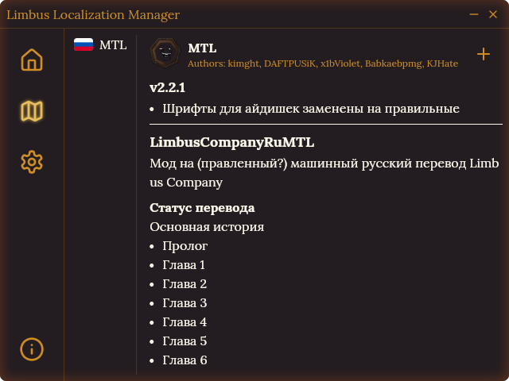
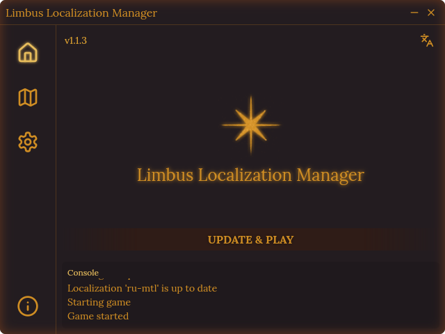

   
# LimbusLocalizationManager
A simple tool for managing Limbus Company localizations

**Readme language** 
[English](./README.md) | [Русский](./docs/README.ru.md)

# Currently available
- [**MTL**](https://github.com/kimght/LimbusCompanyRuMTL) (RU)

# Installation
1. Download the latest version for your operation system from [releases](https://github.com/kimght/LimbusLocalizationManager/releases)
   - For Windows users: `LimbusLocalizationManager_Setup_x.x.x.exe`
2. Run the installer
   - Do not worry if Windows SmartScreen or antivirus warn you about unknown publisher, click `More info` followed by `Run anyway`
3. Follow the installer instructions to complete the installation

# Usage
## Adding localizations
Click the `+` button to install your desired localizations. You can select multiple localizations at the same time, you will be able to switch between them in the game menu.

> Note: The game must be closed during the installation process

Once a localization is installed, you can remove it using the `X` button. Use the `Repair` button to reinstall the latest version of a localization.

## Updating localizations
When an update is available, it will be displayed on the corresponding localization page. You can use the `Repair` button to install it immediately.

But the recommended way to update is by using the `Update & Play` button on the home page. This will automatically:
- Check if all installed localizations are up-to-date
- Upgrade them if necessary
- Launch the game for you

# Contributors

